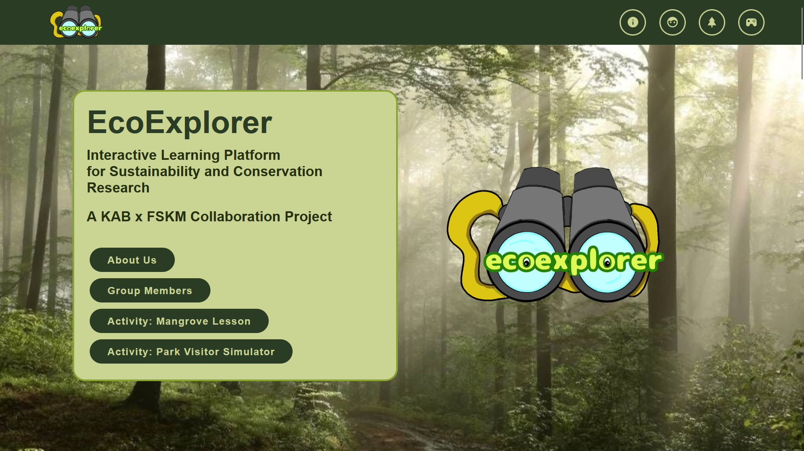
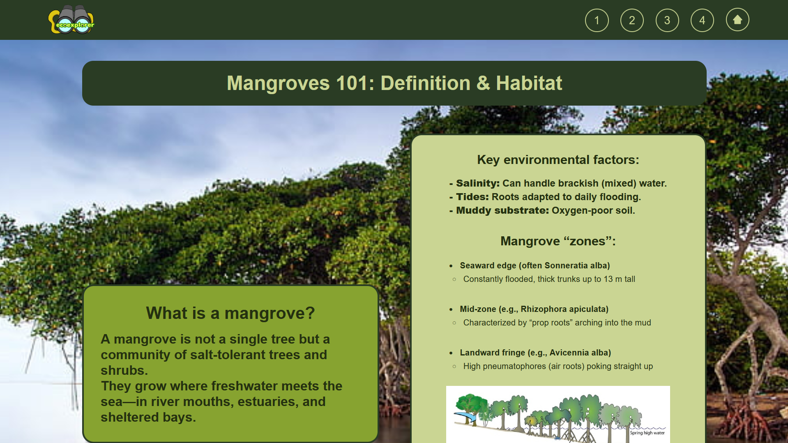
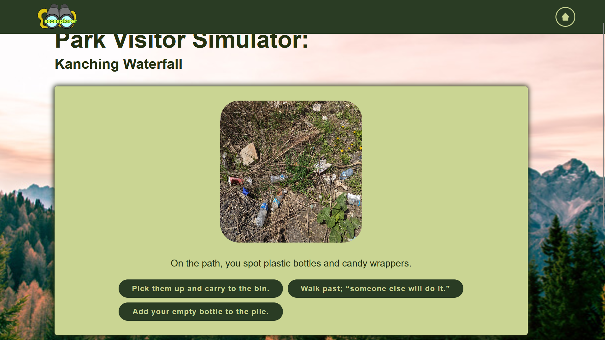
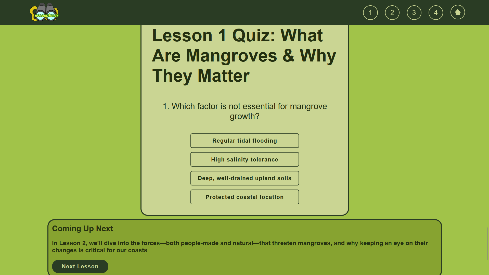

# EcoExplorer

## Overview

EcoExplorer is an interactive educational website developed to promote environmental awareness through multimedia learning. The website introduces users to mangrove ecosystems, conservation efforts, and virtual park experiences using engaging content and interactive activities.

The project was developed using HTML, CSS, and JavaScript as part of a multimedia instructional design project.

---

## Features

- Responsive website design
- Interactive lessons
- Educational quizzes
- Multimedia content
- Environmental awareness activities
- Park Visitor Simulator

---

## Technologies Used

- HTML5
- CSS3
- JavaScript

---

## Website Sections

- Home
- About
- Mangrove Lessons
- Park Visitor Simulator
- Quiz
- Team Information

---

## Live Demo

**Website:** https://zzzalll.github.io/EcoExplorer/

---

## Screenshots

### Home Page

### Lesson Page

### Park Visitor Simulator

### Quiz

---

## Future Improvements

- User accounts
- Progress tracking
- Additional learning modules
- Mobile optimization
- More interactive simulations

---

## Author

Nurul Zalikha Ahmad Zafri
